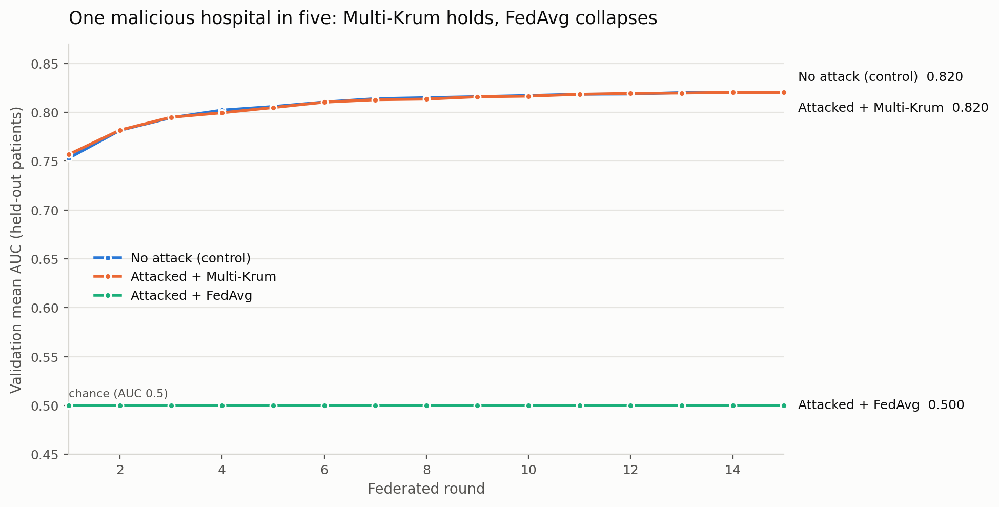

# Sentinel-AI

Privacy-preserving federated learning for chest X-ray diagnosis. Two simulated
hospitals train a ResNet-18 multi-label classifier on NIH ChestX-ray14 without
sharing raw images, coordinated by a Flower server using Multi-Krum
Byzantine-robust aggregation. Grad-CAM provides visual explanations and a
Streamlit dashboard serves predictions.

## Running it

```bash
# 1. One-time: patient-wise split + pre-resize to 256px  (~10 min, 44GB -> 5GB)
python prepare_data.py

# 2. Federated training (server + 2 hospitals)
docker compose up --build

# 3. Score the global model and calibrate per-class thresholds
python evaluate_global.py

# 4. Serve
streamlit run dashboard/app.py
```

Step 1 is required before steps 2-4. It writes `data/client_N_prep/` containing
256x256 PNGs plus `train.csv` / `val.csv`.


## Results

### Diagnostic performance

ResNet-18, 40 federated rounds, 2 hospitals. Scored on **16,776 held-out images
from patients absent from every training set**.

**Mean AUC 0.820** (CheXNet's DenseNet-121 reports 0.841 on this dataset).

| Disease | AUC | | Disease | AUC |
|---|---|---|---|---|
| Edema | 0.906 | | Consolidation | 0.802 |
| Cardiomegaly | 0.899 | | Pleural_Thickening | 0.793 |
| Emphysema | 0.899 | | Atelectasis | 0.784 |
| Pneumothorax | 0.883 | | Nodule | 0.736 |
| Effusion | 0.874 | | Pneumonia | 0.725 |
| Hernia | 0.869 | | Infiltration | 0.699 |
| Fibrosis | 0.809 | | **Mean** | **0.820** |
| Mass | 0.803 | | | |

### Byzantine robustness

5 hospitals, 1 of them malicious, returning a negated and 3x-scaled update
(`ATTACK=signflip`). Identical data, seeds and rounds across all three arms;
only the aggregation rule differs.



| Arm | Final AUC | Outcome |
|---|---|---|
| No attack (control) | 0.8202 | ceiling |
| Attacked + **Multi-Krum** | **0.8204** | **fully defended** |
| Attacked + FedAvg | 0.5000 | destroyed on round 1 |

Plain FedAvg is annihilated by a single attacker in one round: the weights
diverge to NaN and never recover, leaving a model with no diagnostic ability at
all. Multi-Krum scores each update by its distance to neighbours, discards the
outlier, and **retains 100% of clean-baseline performance** while under attack.

Reproduce:

```bash
python repartition.py 5
STRATEGY=fedavg docker compose -f docker-compose.attack.yml up   # collapses
STRATEGY=krum   docker compose -f docker-compose.attack.yml up   # holds
python make_chart.py
```

## Layout

| Path | Role |
|---|---|
| `prepare_data.py` | One-time patient-wise partition, train/val split, image pre-resize |
| `models/dataset.py` | `ChestXrayDataset`, augmentation, per-class `pos_weight`, inference transform |
| `models/resnet_model.py` | Model, AMP training loop, per-class AUC evaluation |
| `models/gradcam.py` | Grad-CAM heatmaps on `layer4[1].conv2` |
| `federated/client.py` | Flower client: local training + honest validation |
| `federated/server.py` | Multi-Krum aggregation, LR schedule, best-model checkpointing |
| `evaluate_global.py` | Held-out scoring + Youden-J threshold calibration |
| `dashboard/app.py` | Streamlit inference UI |

## Configuration

Set via environment in `docker-compose.yml`:

| Variable | Default | Meaning |
|---|---|---|
| `NUM_ROUNDS` | 40 | Federated rounds |
| `SAMPLES_PER_ROUND` | 12000 | Images each hospital trains on per round |
| `NUM_WORKERS` | 16 | DataLoader workers per hospital |
| `BATCH_SIZE` | 64 | Training batch size |
| `LEARNING_RATE` | 1e-4 | Peak LR, cosine-decayed to `MIN_LR` |
| `NUM_MALICIOUS` | 0 | Byzantine clients Multi-Krum should tolerate |

## Notes on correctness

- **Patients are disjoint** across hospitals and across train/val. The original
  alternating-image split put 13,302 patients in both hospitals, and any
  image-level train/val split would have leaked a patient's other scans into
  validation, inflating AUC.
- **`shm_size: '8gb'`** is required in compose. Docker's default 64MB `/dev/shm`
  makes multi-worker DataLoaders die with `Bus error`.
- **AUC, not accuracy**, is the metric. 53.7% of images have no finding and
  Hernia appears in 0.19%, so a model predicting all-negative scores ~99%
  "accurate" while being clinically useless.
